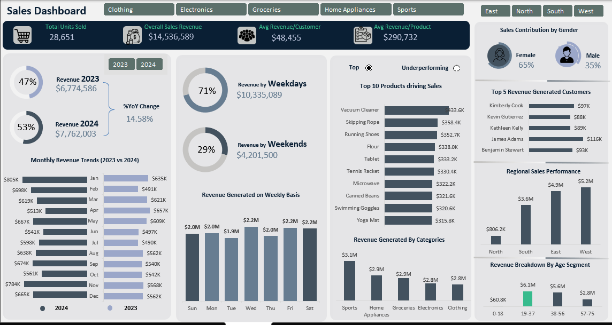

# Sales Analysis Dashboard (Excel)

##  Overview
This project analyzes sales performance across regions, products, and customer segments.

##  Objectives
- Track revenue trends
- Identify top-performing products
- Analyze customer behavior

##  Key Insights
- Revenue increased by 14.58% YoY
- Weekdays generate 71% of revenue
- Female customers contribute 65%

##  Tools Used
- Microsoft Excel
- Pivot Tables
- Power Query
- Data Visualization
  
##  Dashboard Preview

